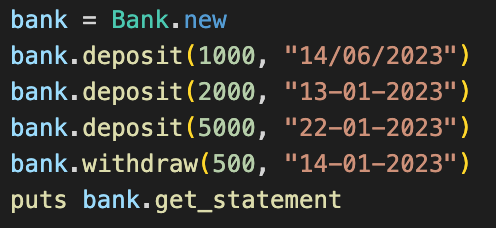
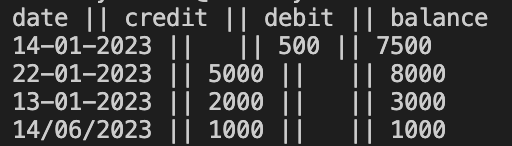

# Bank tech test

## Project Description
This project aims to help users to control their bank accounts. It allows users to add or withdraw money and print the bank statement. 

## Project approach
I used Ruby as the main language for this project. RSpec and simplecov for testing.

The program consists of one class, which has 4 methods: 

1. Initialize - this method sets the initial values of the object - balance and statement.

2. Deposit - this method takes two arguments: amount of money for the transaction and the ctransaction date. This method allows users to deposit money to the bank account.

3. Withdraw - takes two arguments: amount of money for the transaction and the ctransaction date. This method allows users to withdraw money from the bank account.

4. Get_statement - prints out the account statement.

## Table of Contents
The program consists of a single class(one file) and one file with tests.

## Input and output
Input example:  

Respective output:  

## Project dependencies
1. Install the latest Ruby version
`rvm get stable`
`rvm use ruby --latest --install --default`

2. Install bundler & create bundle project
`gem install bundler`
`bundle init`

3. Install RSpec so you could run tests & generate RSpec template
`bundle add rspec`
`rspec --init`

4. To run the tests use the following command
`rspec`

## How to use the project
First, create an object from a class, for example:

`bank = Bank.new`

Then, call the methods according to your needs (deposit, withdraw or get statement):

`bank.deposit(1000, "14/06/2023")`
`bank.deposit(2000, "13-01-2023")`
`bank.deposit(5000, "22-01-2023")`
`bank.withdraw(500, "14-01-2023")`
`puts bank.get_statement` 